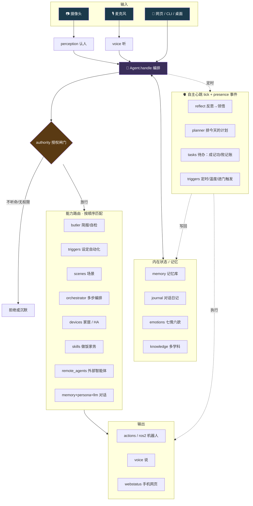

# digital-soul · 总览手册

一页看懂这套**完全本地运行**的数字分身：它用你的性格、记忆与关系来对话和行动，
认得你的人、记得你的事、知道听谁的，并且像贾维斯一样能控家居、办多步任务、自主反思与主动跟进。

> 配套：根目录 `README.md`（特性清单）、`docs/deploy.md`（部署）、`docs/finetune.md`（微调）。
> 想一眼跑通全链路：`python scripts/jarvis_demo.py`。

---

## 1. 架构总览



**一句话**：感知（认人/听）→ **授权闸门** → 能力路由（管家/家居/场景/编排/技能/派活/对话）→ 输出（机器人/语音/网页），
背后有记忆与七情等内在状态，并由**自主心跳**定期反思、规划、跟进、触发自动化。

---

## 2. `handle()` 的路由顺序

一条话进来，依次尝试匹配（命中即返回；全程受授权约束，多数能力只对"听命于你的人"开放）：

| # | 路由 | 触发例子 | 模块 |
|---|---|---|---|
| 0 | 动作授权 | 带 `action=shutdown` | `authority` |
| 1 | 派活二段确认 | 上一轮提议后你说"好" | `agent.nl/_run_pending` |
| 2 | 重试待办 | "再试一次" | `agent.retry_open` |
| 3 | 管家：点名/简报/自检 | "贾维斯，简报" | `butler` |
| 4 | 设定自动化 | "每天22点提醒锁门" | `triggers` |
| 5 | 场景 | "我回来了" | `scenes` |
| 6 | 多步编排 | "开灯，再放音乐" | `orchestrator` |
| 7 | 设备控制 | "把灯关了" | `devices` |
| 8 | 自然语言派活 | "让 openclaw 打包" | `remote_agents` |
| 9 | 主动提议派活 | "周报还没弄" → 提议 | `agent.propose_dispatch` |
| 10 | 普通对话 | 其它任何话 | `memory`+`persona`+`llm` |

**自主心跳 `tick()`**（daemon 定时调用）：① 攒够新经历→`reflect` 提炼领悟写回记忆；
② 每天→`planner` 排计划；③ 逐条推进计划（办成销账/到点提醒）。
并行还有 `trigger_loop`（定时+温度条件）与 presence 进门事件触发。

---

## 3. 模块地图（`dsoul/`，纯本地、零重型依赖、各自可单测）

| 模块 | 职责 |
|---|---|
| `agent.py` | 核心编排：`handle()` 路由 + `tick()` 自主心跳 + 各能力入口 |
| `loader.py` · `cli.py` | 按配置装配整个 Agent；命令行入口 |
| `authority.py` | 授权闸门：听谁的、谁有权让我做什么、爱谁守护谁 |
| `persona.py` · `personas.py` | 人格提示词；16 套人设的热切换 |
| `memory.py` | 个人记忆库（RAG，语义/词法双模） |
| `journal.py` · `consolidate.py` | 对话日记 + 睡眠巩固成长期记忆 |
| `annotate.py` | 给记忆打情感标签、抽取时间 |
| `reflect.py` · `planner.py` | 自主反思→领悟；自主规划→今天的计划 |
| `graph.py` | 记忆图谱：人—事—主题关系网（中心度/实体检索/连接） |
| `forgetting.py` | 记忆遗忘曲线：强度随时间衰减、被回忆/情感/重要性强化 |
| `entangle.py` | 量子纠缠式记忆：相关记忆扩散激活，测量其一牵动其二 |
| `tasks.py` | 派活待办本：成记功、败记账、可跟进重试 |
| `emotions.py` · `knowledge.py` | 七情六欲随互动起伏；多学科视角调度 |
| `perception.py` · `perception_opencv.py` · `presence.py` | 人脸认人；树莓派轻量后端；持续感知/进门事件 |
| `voice.py` | 本地听（Whisper）+ 说（离线 TTS，语气随七情变化） |
| `actions.py` · `ros2_robot.py` | 机器人动作接口（模拟 / ROS2） |
| `llm.py` | 本地大模型（Ollama），未接则优雅降级 |
| `butler.py` | 贾维斯管家层：态势简报 + 系统自检 |
| `devices.py` | 家居控制：内存模拟 + Home Assistant 后端 |
| `scenes.py` · `triggers.py` | 场景/例程；定时·日落·温度·进门自动化 |
| `orchestrator.py` | 多步任务拆解与路由汇总 |
| `remote_agents.py` | 隔空指挥外部智能体（爱马仕/openclaw…） |
| `webstatus.py` | 手机网页：状态/对话/设备/场景/自动化 + 关系图谱·一生时间线 |

## 4. 脚本地图（`scripts/`）

| 脚本 | 用途 |
|---|---|
| `demo.py` | 30 秒看懂：认人→对话→巩固→次日记得 |
| `jarvis_demo.py` | 贾维斯语音闭环：唤醒→简报→控家居→编排→场景→自动化→晨报 |
| `demo_agents.py` | 一条命令跑通"隔空指挥外部智能体" |
| `graph.py` | 记忆图谱探索器：核心实体 / 关联 / 两人连接 |
| `forgetting.py` | 遗忘曲线演示：随时间淡忘、回忆唤醒 |
| `daemon.py` | 一键常驻：感知+巩固+自主心跳+自动化（`--voice --wake --web`） |
| `chat.py` · `desktop.py` · `voice_chat.py` | 终端 / 桌面 GUI / 语音 对话 |
| `watch.py` | 摄像头持续感知、进画面主动打招呼 |
| `sleep.py` · `timeline.py` · `ingest.py` | 睡眠巩固 / 一生时间线 / 文档灌记忆 |
| `finetune_prepare.py` · `finetune_train.py` | QLoRA 本地微调贴近本人文风 |
| `agent_worker.py` | 外部智能体参考实现（监听 `POST /task`） |
| `doctor.py` | 环境自检 |

---

## 5. 数据与隐私

- **全本地**：16G 内存即可，认人/记忆/对话/家居都不出本机。
- **不入库**：个人记忆索引、人脸照片、对话日记、待办、计划、自动化、微调产物均已 `.gitignore`
  （`data/memories/index.json`、`data/faces/*`、`data/journal/*`、`data/tasks.json`、`data/plan.json`、`data/triggers.json`、`data/finetune/*`）。
- **授权优先**：陌生人指挥不动家居、问不出近况；守护对象可被特别保护。

## 6. 测试

21 套单测、约 75+ 用例，纯标准库、零网络即可跑：

```bash
cd digital-soul
for t in authority memory annotate presence consolidate emotions skills dispatch tasks reflect \
         plan butler devices orchestrate scenes triggers ha graph voice forgetting entangle; do
  python tests/test_$t.py || break
done
```

CI 见 `.github/workflows/digital-soul-tests.yml`。

## 7. 快速开始

```bash
pip install -r requirements.txt            # 基础依赖（大模型/语音/视觉为可选增强）
python scripts/demo.py                     # 看懂"一天"
python scripts/jarvis_demo.py              # 看懂"贾维斯"
python scripts/chat.py                     # 直接聊
python scripts/daemon.py --web --voice --wake 贾维斯   # 常驻：看+听+说+网页+自动化
```

接本地大模型发挥全部性格：装 [Ollama](https://ollama.com) 后 `ollama pull qwen2.5:7b-instruct`。
对接真实家居：填好 `config/devices.yaml` 的 `home_assistant`。
