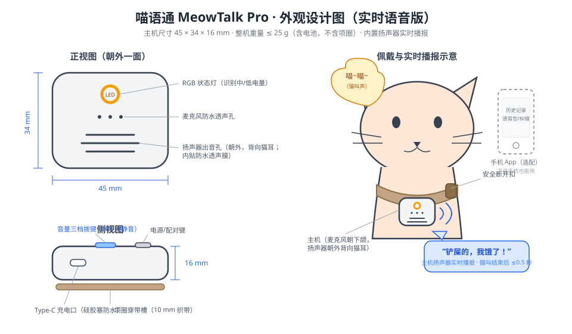
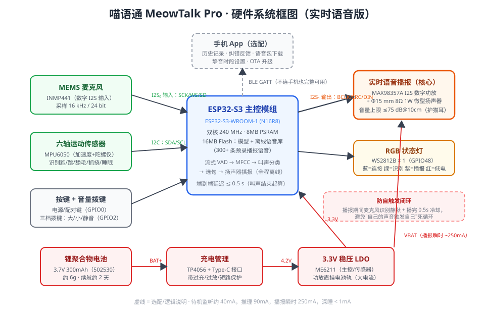
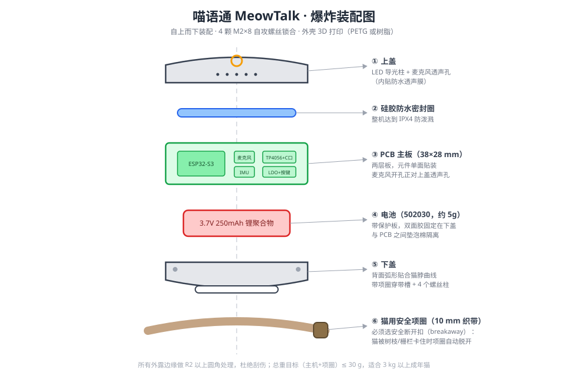
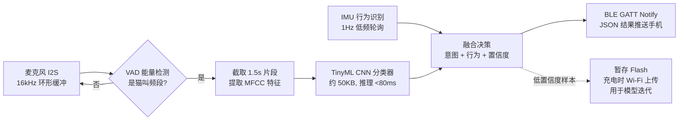

# 喵语通 MeowTalk · 猫咪语言翻译器（项圈式）设计方案

> 一个戴在猫咪脖子上的小设备：监听猫叫声 + 动作，用端侧 AI 把叫声分类成"想表达的意思"，
> 通过低功耗蓝牙推送到手机 App，用人话（和语音）展示出来 —— "铲屎的，我饿了！"
>
> ⚠️ 诚实声明：猫没有"语言"，学界共识是猫叫主要用于对人表达**意图和情绪**。
> 本设备做的是**叫声意图分类 + 行为识别**，不是逐词翻译。这也正是它能真正做准的原因。

---

## 一、产品定义

| 项目 | 指标 |
|---|---|
| 形态 | 项圈挂坠式主机，42 × 32 × 14 mm |
| 重量 | 主机 ≤ 20 g（含电池），主机+项圈 ≤ 30 g，适合 3 kg 以上成年猫 |
| 识别能力 | 8 类叫声意图 + 5 类行为状态（见下文） |
| 连接 | BLE 5.0（默认）；Wi-Fi 仅在充电时用于 OTA 升级 |
| 续航 | 250 mAh，典型使用 2~3 天；深睡电流 < 1 mA |
| 充电 | Type-C，1 小时充满 |
| 防护 | IPX4 防泼溅（防舔水、洗手池溅水） |
| 安全 | 项圈必须使用安全断开扣（breakaway），卡挂时自动脱落 |

### 能"翻译"什么

**叫声意图（麦克风 + 声学模型）**：

| 类别 | 声学特征（示例） | App 显示（示例文案） |
|---|---|---|
| 讨食 | 中频、重复、上扬的"喵~喵~" | "开饭！我的碗空了" |
| 求关注 | 短促高频"咪" | "看看我，摸摸我" |
| 打招呼 | 颤音"咕噜噜"（trill） | "你回来啦～" |
| 满足 | 呼噜声（purr，25~150 Hz） | "现在很舒服" |
| 不满/抗议 | 拖长的低频嚎叫 | "我不高兴了" |
| 警告 | 嘶吼（hiss/growl） | "别过来！" |
| 疼痛/求助 | 尖锐急促的高频叫 | "⚠️ 我可能不舒服，请检查" |
| 发情 | 特征性长嚎 | "春天来了…" |
| （追猎） | 对鸟"咔咔"声（chatter）— 数据够时再加 | "锁定目标中" |

**行为状态（IMU 六轴传感器）**：睡眠 / 安静 / 走动 / 奔跑跳跃 / 舔毛抓挠（抓挠频繁可提示皮肤问题）。

声音 + 行为**融合**判断可显著提高准确率：例如"讨食叫 + 在食盆附近徘徊"置信度更高；"疼痛叫 + 长时间不动"触发健康提醒。

---

## 二、设计图

### 1. 外观与佩戴

要点：
- 主机挂在项圈下方、猫下颌正下方 —— 离声源最近，拾音信噪比最高，也最不影响活动；
- 正面只留 LED 状态灯环和麦克风透声孔（内贴防水透声膜）；
- 侧面 Type-C 充电口（硅胶塞）+ 单个多功能按键；
- 底面弧形贴合脖颈，项圈织带从背面穿带槽穿过，主机不晃动。

### 2. 硬件系统框图 / 接线

接线速查：

| 外设 | 总线/引脚 | 说明 |
|---|---|---|
| INMP441 麦克风 | I2S：SCK→GPIO4，WS→GPIO5，SD→GPIO6 | 16 kHz / 24 bit 采样 |
| MPU6050 IMU | I2C：SDA→GPIO8，SCL→GPIO9，INT→GPIO10 | 运动中断可唤醒主控 |
| WS2812B 状态灯 | GPIO48 | 蓝=已连接，绿=识别中，红=低电 |
| 按键 | GPIO0（复用 BOOT） | 长按 3s 开关机，双击进配对 |
| 电池电压检测 | GPIO1（ADC，经 100k/100k 分压） | 低于 3.5 V 报低电 |
| MAX98357A（选配） | I2S 输出：GPIO15/16/17 | 播放提示音/铲屎官呼唤音 |

电源链路：`电池 3.7V → TP4056（Type-C 充电+保护） → ME6211 LDO 3.3V → 全系统`。

### 3. 爆炸装配图

装配顺序：下盖 → 电池（双面胶+泡棉垫）→ PCB（对准螺丝柱）→ 防水圈 → 上盖（4 × M2×8 自攻螺丝）→ 穿项圈织带。

---

## 三、材料清单（BOM）

以淘宝/立创商城散件价估算，做 1 台原型机的成本：

### 核心电子件（必需）

| # | 物料 | 规格/型号 | 数量 | 参考单价 | 小计 | 备注 |
|---|---|---|---|---|---|---|
| 1 | 主控模组 | ESP32-S3-WROOM-1-N8R8（8MB Flash + 8MB PSRAM） | 1 | ¥25 | ¥25 | 带 BLE5.0/Wi-Fi 天线，支持向量指令跑 TinyML |
| 2 | 数字麦克风 | INMP441（I2S MEMS）模块 | 1 | ¥8 | ¥8 | 也可换 MSM261S4030（更小） |
| 3 | 六轴传感器 | MPU6050 模块（GY-521） | 1 | ¥6 | ¥6 | 量产可换 BMI160（更省电） |
| 4 | 充电管理 | TP4056 Type-C 模块（带 DW01 保护） | 1 | ¥3 | ¥3 | 充电电流电阻改为 250 mA 档 |
| 5 | 稳压 LDO | ME6211C33（SOT-23-5） | 1 | ¥1 | ¥1 | 静态电流仅 40 µA，别用 AMS1117（太耗电） |
| 6 | 电池 | 3.7V 250 mAh 锂聚合物 502030（带保护板） | 1 | ¥12 | ¥12 | 约 5 g，尺寸 30×20×5 mm |
| 7 | 状态灯 | WS2812B-2020 | 1 | ¥1 | ¥1 | |
| 8 | 按键 | 3×4×2.5 mm 贴片轻触开关 | 1 | ¥0.5 | ¥0.5 | |
| 9 | 阻容件 | 0402/0603 电阻电容一批（分压、去耦、上拉） | 1 套 | ¥3 | ¥3 | 100k×2、10k×2、10µF×4、100nF×6 等 |
| 10 | PCB | 两层板 38×28 mm，嘉立创打样 | 5 片起 | ¥15 | ¥15 | 原型阶段也可先用洞洞板+杜邦线飞线 |

### 结构与佩戴件（必需）

| # | 物料 | 规格 | 数量 | 参考单价 | 小计 | 备注 |
|---|---|---|---|---|---|---|
| 11 | 外壳上/下盖 | 3D 打印，PETG 或光固化树脂 | 1 套 | ¥20 | ¥20 | 自有打印机成本约 ¥3；边缘全部 R2 圆角 |
| 12 | 防水透声膜 | ePTFE 声学防水膜贴片 | 2 | ¥2 | ¥4 | 贴麦克风孔和喇叭孔内侧 |
| 13 | 硅胶密封圈 + Type-C 防尘塞 | 定制/通用 | 1 套 | ¥3 | ¥3 | |
| 14 | 猫用安全项圈 | 10 mm 织带、**安全断开扣（breakaway）** | 1 | ¥15 | ¥15 | ⚠️ 安全底线：不许用普通不脱扣项圈 |
| 15 | 螺丝 | M2×8 自攻 | 4 | ¥0.2 | ¥1 | |
| 16 | 辅料 | 3M 双面胶、EVA 泡棉、硅胶导线 30AWG | 1 套 | ¥5 | ¥5 | |

### 选配件

| # | 物料 | 规格 | 数量 | 参考单价 | 小计 | 用途 |
|---|---|---|---|---|---|---|
| 17 | I2S 功放 | MAX98357A 模块 | 1 | ¥10 | ¥10 | 让项圈能发声（提示音、远程呼唤） |
| 18 | 微型扬声器 | Φ15 mm 8Ω 1W | 1 | ¥5 | ¥5 | 配 17 使用 |
| 19 | USB-TTL 调试器 | CH343 / CP2102 | 1 | ¥10 | ¥10 | 烧录固件用（ESP32-S3 也可直接用 USB 烧录） |

**合计：必需件约 ¥123；含选配约 ¥148。**（首台原型含打样/邮费实际预算建议 ¥200）

### 开发工具（软件，全部免费）

- 固件：ESP-IDF 5.x 或 Arduino-ESP32（C/C++）
- 模型训练：[Edge Impulse](https://edgeimpulse.com/)（免费额度够用，直接导出 ESP32 TinyML 库）或 PyTorch + ONNX → esp-dl
- App：微信小程序（BLE 能力现成，正好接本仓库已有的小程序工程）或 Flutter
- 数据集冷启动：公开猫叫数据集 **CatMeows**（Zenodo，约 440 条标注叫声：讨食/梳毛不满/陌生环境三类）+ 自采数据

---

## 四、软件方案

### 端侧流水线（ESP32-S3 固件）

- **两级唤醒省电**：平时主控轻睡，由麦克风能量阈值 + IMU 运动中断唤醒，只有疑似猫叫才跑模型；
- BLE 只推送**分类结果**（几十字节），不传音频流，省电且保护隐私；
- 每只猫叫声有个体差异，App 提供"纠错"按钮（"刚才其实是想出门"），纠错样本回传用于**个性化微调**——这是准确率从 60% 到 85%+ 的关键。

### App 端

- 实时卡片：显示翻译文案 + 置信度 + 可爱 TTS 语音播报；
- 历史时间线：叫声/行为记录，生成"今日猫生报告"；
- 健康提醒：疼痛叫声、抓挠频率异常、活动量骤降时推送；
- 多猫家庭：每台设备绑定一只猫的档案。

---

## 五、安全与合规红线（做宠物硬件必读）

1. **项圈必须用安全断开扣**——猫会钻缝隙、爬树，普通项圈有勒住风险，这是不可妥协项；
2. 总重 ≤ 30 g（猫舒适上限约为体重 1%），幼猫（< 3 kg）不建议佩戴；
3. 电池带保护板、外壳无外露金属触点（Type-C 口加塞），防止舔舐短路；
4. 所有边缘 R2 以上圆角，螺丝沉头不外凸；
5. 无线功率用 BLE 默认 0 dBm 档即可，不需要大功率；
6. 宣传口径写"叫声情绪/意图识别"，不承诺"精准翻译猫语"，避免虚假宣传。

---

## 六、开发路线图

| 阶段 | 内容 | 周期 |
|---|---|---|
| P0 桌面验证 | 洞洞板飞线 ESP32-S3 + INMP441，用 CatMeows 数据集训练 3 分类模型，串口打印结果 | 1~2 周 |
| P1 原型机 | 打 PCB、打印外壳、上项圈实测；自采本猫数据扩到 8 分类 | 3~4 周 |
| P2 App 联调 | BLE 协议 + 小程序/App 实时卡片、纠错回传闭环 | 2~3 周 |
| P3 个性化 | 纠错样本微调，续航优化到 3 天，IPX4 淋水测试 | 持续 |
