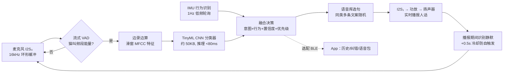

# 喵语通 MeowTalk Pro · 猫咪语言翻译器（项圈式 · 实时语音版）设计方案

> 一个戴在猫咪脖子上的小设备：监听猫叫声 + 动作，用端侧 AI 实时把叫声分类成"想表达的意思"，
> **直接从项圈上的扬声器用人话说出来**——猫叫结束后 0.5 秒内，"铲屎的，我饿了！"
> 全程离线运行，不需要手机、不需要联网；手机 App 只是选配（看历史、换语音包、纠错）。
>
> ⚠️ 诚实声明：猫没有"语言"，学界共识是猫叫主要用于对人表达**意图和情绪**。
> 本设备做的是**叫声意图分类 + 行为识别**，不是逐词翻译。这也正是它能真正做准的原因。

---

## 一、产品定义

| 项目 | 指标 |
|---|---|
| 形态 | 项圈挂坠式主机，45 × 34 × 16 mm |
| 重量 | 主机 ≤ 25 g（含电池），主机+项圈 ≤ 35 g，适合 3.5 kg 以上成年猫 |
| **实时播报** | **内置扬声器直接说人话，猫叫结束后 ≤ 0.5 s 出声，全程离线** |
| 识别能力 | 8 类叫声意图 + 5 类行为状态（见下文） |
| 语音库 | 16MB Flash 内置 300+ 条预录语音，每类意图多条文案随机播，支持换语音包 |
| 音量 | 三档物理拨键：大 / 小 / 静音；上限 ≤ 75 dB@10cm（保护猫耳） |
| 连接 | 无需连接即完整可用；BLE 5.0 选配连 App；Wi-Fi 仅充电时 OTA |
| 续航 | 300 mAh，典型使用约 2 天；深睡电流 < 1 mA |
| 充电 | Type-C，约 1.2 小时充满 |
| 防护 | IPX4 防泼溅（扬声器/麦克风孔内贴防水透声膜） |
| 安全 | 项圈必须使用安全断开扣（breakaway），卡挂时自动脱落 |

### 能"翻译"什么

**叫声意图（麦克风 + 声学模型）**：

| 类别 | 声学特征（示例） | 扬声器播报（示例文案，每类 30+ 条随机） |
|---|---|---|
| 讨食 | 中频、重复、上扬的"喵~喵~" | "开饭！我的碗空了" / "铲屎的，我饿了！" |
| 求关注 | 短促高频"咪" | "看看我，摸摸我" / "陪我玩五分钟" |
| 打招呼 | 颤音"咕噜噜"（trill） | "你回来啦～" |
| 满足 | 呼噜声（purr，25~150 Hz） | "现在很舒服"（默认小声或不播） |
| 不满/抗议 | 拖长的低频嚎叫 | "我不高兴了" |
| 警告 | 嘶吼（hiss/growl） | "别过来！"（默认只亮灯不出声，避免火上浇油） |
| 疼痛/求助 | 尖锐急促的高频叫 | "⚠️ 我可能不舒服，请检查"（最高优先级，必播） |
| 发情 | 特征性长嚎 | "春天来了…" |

**行为状态（IMU 六轴传感器）**：睡眠 / 安静 / 走动 / 奔跑跳跃 / 舔毛抓挠（抓挠频繁可提示皮肤问题）。

声音 + 行为**融合**判断可显著提高准确率：例如"讨食叫 + 在食盆附近徘徊"置信度更高；"疼痛叫 + 长时间不动"触发健康提醒并必定播报。

---

## 二、设计图

### 1. 外观与佩戴

要点：
- 主机挂在项圈下方、猫下颌正下方——离声源最近，拾音信噪比最高；
- **扬声器出音孔朝外、背向猫耳**，人听得清、猫不吵；
- 正面：LED 状态灯环 + 麦克风透声孔 + 扬声器栅格（均内贴防水透声膜）；
- 侧面：Type-C 充电口（硅胶塞）、**音量三档拨键（大/小/静音）**、电源/配对键；
- 底面弧形贴合脖颈，项圈织带从背面穿带槽穿过，主机不晃动。

### 2. 硬件系统框图 / 接线

接线速查：

| 外设 | 总线/引脚 | 说明 |
|---|---|---|
| INMP441 麦克风 | I2S₀ 输入：SCK→GPIO4，WS→GPIO5，SD→GPIO6 | 16 kHz / 24 bit 采样 |
| **MAX98357A 功放** | **I2S₁ 输出：BCLK→GPIO15，LRC→GPIO16，DIN→GPIO17，SD_MODE→GPIO18** | 接 Φ15mm 8Ω 1W 扬声器；SD_MODE 拉低可整体关断省电 |
| MPU6050 IMU | I2C：SDA→GPIO8，SCL→GPIO9，INT→GPIO10 | 运动中断可唤醒主控 |
| WS2812B 状态灯 | GPIO48 | 蓝=连接，绿=识别，紫=播报中，红=低电 |
| 按键 | GPIO0（复用 BOOT） | 长按 3s 开关机，双击进配对 |
| 音量拨键 | GPIO2（三态检测） | 大 / 小 / 静音 |
| 电池电压检测 | GPIO1（ADC，经 100k/100k 分压） | 低于 3.5 V 报低电 |

电源链路：`电池 3.7V → TP4056（Type-C 充电+保护） → ME6211 LDO 3.3V → 主控/传感器`；
**功放 MAX98357A 直挂电池轨**（播报瞬时 ~250 mA，走 LDO 会压降失声），VBAT 处并 220 µF 大电容稳压。

ESP32-S3 有两组独立 I2S 控制器，录音（I2S₀）和放音（I2S₁）互不干扰，这是选它做实时翻译的关键原因之一。

### 3. 爆炸装配图

装配顺序：下盖 → 电池（双面胶+泡棉垫）→ PCB（对准螺丝柱）→ 扬声器（硅胶圈减振，振膜对准上盖栅格，导线焊到功放焊盘）→ 防水圈 → 上盖（4 × M2×10 自攻螺丝）→ 穿项圈织带。

---

## 三、材料清单（BOM）

以淘宝/立创商城散件价估算，做 1 台原型机的成本：

### 核心电子件（必需）

| # | 物料 | 规格/型号 | 数量 | 参考单价 | 小计 | 备注 |
|---|---|---|---|---|---|---|
| 1 | 主控模组 | ESP32-S3-WROOM-1-**N16R8**（16MB Flash + 8MB PSRAM） | 1 | ¥28 | ¥28 | 16MB 版：8MB 放固件+模型，8MB 放离线语音库 |
| 2 | 数字麦克风 | INMP441（I2S MEMS）模块 | 1 | ¥8 | ¥8 | 也可换 MSM261S4030（更小） |
| 3 | **I2S 数字功放** | **MAX98357A 模块** | 1 | ¥10 | ¥10 | 实时播报核心；I2S 直入，免 DAC |
| 4 | **微型扬声器** | **Φ15 mm 8Ω 1W（带引线）** | 1 | ¥5 | ¥5 | 腔体越封闭音质越好，外壳预留声腔 |
| 5 | 六轴传感器 | MPU6050 模块（GY-521） | 1 | ¥6 | ¥6 | 量产可换 BMI160（更省电） |
| 6 | 充电管理 | TP4056 Type-C 模块（带 DW01 保护） | 1 | ¥3 | ¥3 | 充电电流电阻改为 300 mA 档 |
| 7 | 稳压 LDO | ME6211C33（SOT-23-5） | 1 | ¥1 | ¥1 | 静态电流仅 40 µA；功放不走 LDO，直挂电池 |
| 8 | 电池 | 3.7V **300 mAh** 锂聚合物 502530（带保护板） | 1 | ¥14 | ¥14 | 约 6g；播报耗电比纯 BLE 版大，容量加大一档 |
| 9 | 状态灯 | WS2812B-2020 | 1 | ¥1 | ¥1 | |
| 10 | 按键 + 拨键 | 3×4 贴片轻触开关 ×1、三档拨动开关 ×1 | 各1 | ¥1.5 | ¥3 | 拨键做音量 大/小/静音 |
| 11 | 阻容件 | 0402/0603 电阻电容一批 + **220 µF 钽电容** | 1 套 | ¥5 | ¥5 | 220 µF 给功放瞬时大电流稳压，不能省 |
| 12 | PCB | 两层板 40×30 mm，嘉立创打样 | 5 片起 | ¥15 | ¥15 | 原型阶段也可先用洞洞板+杜邦线飞线 |

### 结构与佩戴件（必需）

| # | 物料 | 规格 | 数量 | 参考单价 | 小计 | 备注 |
|---|---|---|---|---|---|---|
| 13 | 外壳上/下盖 | 3D 打印，PETG 或光固化树脂 | 1 套 | ¥20 | ¥20 | 自有打印机成本约 ¥3；边缘全部 R2 圆角；内含扬声器声腔 |
| 14 | 防水透声膜 | ePTFE 声学防水膜贴片 | 3 | ¥2 | ¥6 | 麦克风孔 1 片 + 扬声器栅格 2 片 |
| 15 | 硅胶件 | 密封圈 + Type-C 防尘塞 + 扬声器减振圈 | 1 套 | ¥4 | ¥4 | |
| 16 | 猫用安全项圈 | 10 mm 织带、**安全断开扣（breakaway）** | 1 | ¥15 | ¥15 | ⚠️ 安全底线：不许用普通不脱扣项圈 |
| 17 | 螺丝 | M2×10 自攻 | 4 | ¥0.2 | ¥1 | |
| 18 | 辅料 | 3M 双面胶、EVA 泡棉、硅胶导线 30AWG | 1 套 | ¥5 | ¥5 | |

### 选配件

| # | 物料 | 规格 | 数量 | 参考单价 | 小计 | 用途 |
|---|---|---|---|---|---|---|
| 19 | USB-TTL 调试器 | CH343 / CP2102 | 1 | ¥10 | ¥10 | 烧录调试（ESP32-S3 也可直接 USB 烧录） |

**合计：必需件约 ¥150（首台原型含打样/邮费实际预算建议 ¥220~250）。**

### 开发工具（软件，全部免费）

- 固件：ESP-IDF 5.x 或 Arduino-ESP32（C/C++）
- 模型训练：[Edge Impulse](https://edgeimpulse.com/)（免费额度够用，直接导出 ESP32 TinyML 库）或 PyTorch + ONNX → esp-dl
- **语音库制作**：edge-tts / 火山引擎 TTS 免费额度批量生成文案音频 → 16 kHz 单声道 WAV → 打包进 Flash 分区（也可自己录）
- App（选配）：微信小程序（BLE 能力现成，正好接本仓库已有的小程序工程）或 Flutter
- 数据集冷启动：公开猫叫数据集 **CatMeows**（Zenodo，约 440 条标注叫声）+ 自采数据

---

## 四、软件方案：实时翻译流水线

### 端侧流水线（全程离线，猫叫结束后 ≤ 0.5 s 开口）

### 实时性延迟预算（从猫叫结束起算）

| 环节 | 耗时 | 说明 |
|---|---|---|
| 叫声结束判定（尾静音窗口） | ~200 ms | 流式处理，叫声进行中特征已在滑窗中算完 |
| 模型推理 | < 80 ms | ESP32-S3 向量指令加速 |
| 融合决策 + 选句 | < 20 ms | 查表 + 随机选句 |
| 语音起播（Flash 读 WAV → I2S） | < 100 ms | 预录语音，无 TTS 合成开销 |
| **合计** | **≤ 0.4 s** | 体感"话音刚落就翻译" |

关键取舍：**播报用预录语音而不是端侧 TTS**——延迟从秒级降到百毫秒级、音质可控、还省内存。"实时感"来自流式特征提取（不等录完 1.5s 再算）+ 预录语音（不现场合成）。

### 防自触发与"懂事"策略

- **播报期间麦克风识别静默 + 播完 0.5 s 冷却**：防止设备自己的声音再触发识别，形成死循环；
- 同类意图 30 s 内不重复播报（猫连环讨食叫只翻译第一声，LED 绿灯继续示意）；
- 警告/嘶吼类默认**只亮灯不出声**——猫正炸毛时旁边突然说话会火上浇油；
- 疼痛/求助类**最高优先级、必播**，且同时推 App 通知（若已连接）；
- 静音时段（默认 23:00–7:00）自动转 LED + App 通知，不吵人也不吵猫；
- **新猫适应期**：首周音量自动从最小档逐日递增，让猫习惯"项圈会说话"这件事。

### App 端（选配，不连也完整可用）

- 实时卡片 + 历史时间线，生成"今日猫生报告"；
- **纠错按钮**（"刚才其实是想出门"）：纠错样本回传用于个性化微调——准确率从 60% 到 85%+ 的关键；
- 语音包商店：萌妹音 / 播音腔 / 东北话 / 自己录的声音，OTA 推到设备 Flash；
- 健康提醒：疼痛叫声、抓挠频率异常、活动量骤降时推送。

---

## 五、安全与合规红线（做宠物硬件必读）

1. **项圈必须用安全断开扣**——猫会钻缝隙、爬树，普通项圈有勒住风险，这是不可妥协项；
2. 总重 ≤ 35 g（主机+项圈），幼猫（< 3.5 kg）不建议佩戴；
3. **音量上限 ≤ 75 dB@10cm，出音孔背向猫耳**——猫听觉比人灵敏得多，扬声器不能变成猫的噪音刑具；提供物理静音拨键；
4. 电池带保护板、外壳无外露金属触点（Type-C 口加塞），防止舔舐短路；
5. 所有边缘 R2 以上圆角，螺丝沉头不外凸；
6. 无线功率用 BLE 默认 0 dBm 档即可；
7. 宣传口径写"叫声情绪/意图识别 + 语音播报"，不承诺"精准翻译猫语"，避免虚假宣传。

---

## 六、开发路线图

| 阶段 | 内容 | 周期 |
|---|---|---|
| P0 桌面验证 | 洞洞板飞线 ESP32-S3 + INMP441 + MAX98357A，用 CatMeows 数据集训练 3 分类模型，**识别到猫叫直接播报语音** | 1~2 周 |
| P1 原型机 | 打 PCB、打印外壳（含声腔）、上项圈实测；自采本猫数据扩到 8 分类；调防自触发与冷却策略 | 3~4 周 |
| P2 语音库与体验 | 批量生成 300+ 条播报语音、多语音包分区；适应期音量曲线、静音时段 | 2 周 |
| P3 App 联调（选配） | BLE 协议 + 小程序实时卡片、纠错回传、语音包 OTA | 2~3 周 |
| P4 个性化 | 纠错样本微调，续航优化到 2 天+，IPX4 淋水测试 | 持续 |
